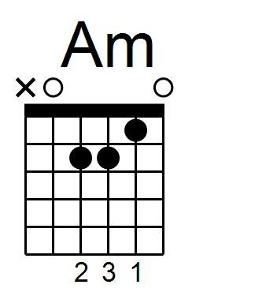
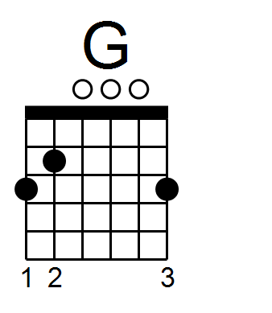
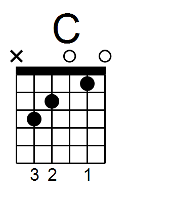
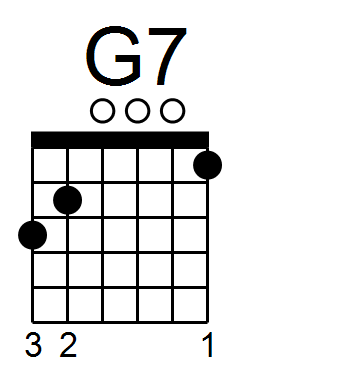
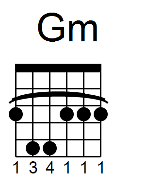
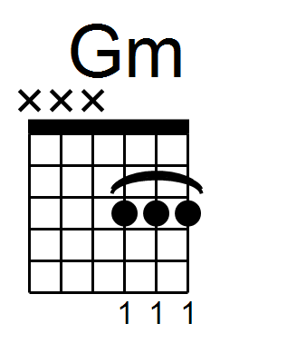
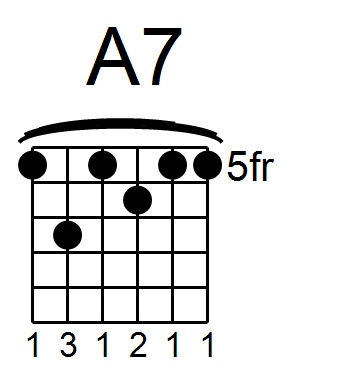
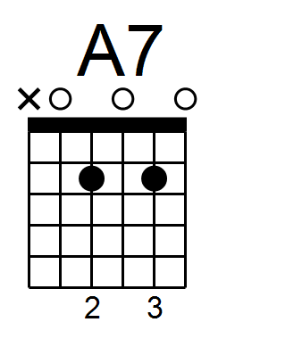
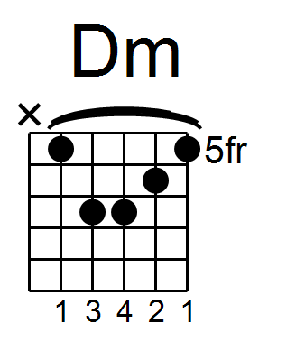
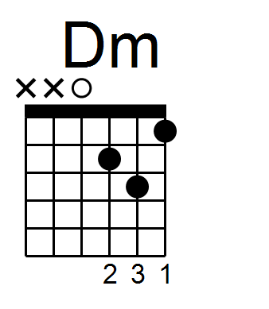

## Oryginalne wykonanie

<iframe width="560" height="315" src="https://www.youtube.com/embed/O1IcbLg-5Bs" frameborder="0" allow="accelerometer; autoplay; encrypted-media; gyroscope; picture-in-picture" allowfullscreen></iframe>

## Lekcja
<iframe width="560" height="315" src="https://www.youtube.com/embed/VAWZvXYMGDY" frameborder="0" allow="accelerometer; autoplay; encrypted-media; gyroscope; picture-in-picture" allowfullscreen></iframe>

## Tekst piosenki:

Gdyby tak ktoś przyszedł i powiedział: 
Stary, czy masz czas? 
Potrzebuję do załogi jakąś nową twarz, 
Amazonka, Wielka Rafa,  oceany trzy, 
Rejs na całość, rok, dwa lata - to powiedziałbym:   

Gdzie ta keja, a przy niej ten jacht? 
Gdzie ta koja wymarzona w snach? 
Gdzie te wszystkie sznurki od tych szmat? 
Gdzie ta brama na szeroki świat?   

Gdzie ta keja, a przy niej ten jacht? 
Gdzie ta koja wymarzona w snach? 
W każdej chwili płynę w taki   rejs, 
Tylko gdzie to jest?  No gdzie to jest?   

Gdzieś na dnie wielkiej szafy leży ostry nóż,  
Stare dżinsy wystrzępione impregnuje kurz,  
W kompasie igła zardzewiała, lecz kierunek znam,   
Biorę wór na plecy i przed siebie gnam.  
 

<i>Gdzie ta keja, a przy niej ten jacht...</i> 
  
  
Przeszły lata zapyziałe, rzęsą zarósł staw, 
A na przystani czółno stało - kolorowy paw.   Zaokrągliły się marzenia, wyjałowiał step,   
Lecz ciągle marzy o załodze ten samotny łeb. 
 

<i>Gdzie ta keja, a przy niej ten jacht...</i> 

## Chwyty w piosence:

|  |  |
|--------|------|
|  |  | 
|  |  |
|  |  | 
|  |  | 

Dla chwytów Gm, A7, Dm: w lewej kolumnie znajdują się te używane w oryginalnej wersji, w prawej proponowane zamienniki jeśli chcemy uniknać chwytów barowych.

## Dodatkowe informacje
- Muzyka i tekst: Jerzy Porębski
- [Wywiad z autorem z okazji czterdziestolecia powstania szanty "Gdzie ta keja" ](https://podroze.onet.pl/ciekawe/40-lat-szanty-gdzie-ta-keja/z0bfrc9)